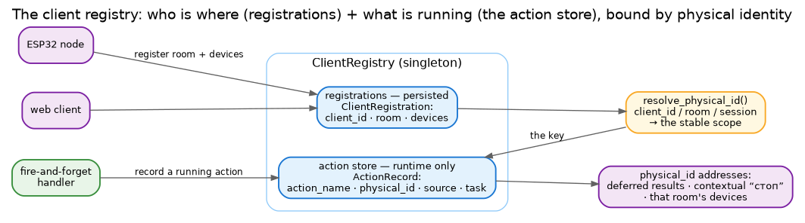

# Client registry

The client registry is Irene's memory of **who is connected and what they are doing**. It holds two stores
with very different lifetimes, bound together by one idea — *physical identity*.



- **Registrations** — *persisted.* Who is out there: each `ClientRegistration` is a connected client (an
  ESP32 node, a web client) with its `client_id`, its `room_name`, and the `ClientDevice`s in that room.
  Survives restarts.
- **The action store** — *runtime only.* What is running right now: one `ActionRecord` per live
  fire-and-forget action. It holds a live `asyncio.Task` reference, so it must never be persisted — it is
  deliberately kept separate from the registrations.

## Registrations

A client registers once, declaring its room and devices:

```python
await registry.register_esp32_node(
    client_id="kitchen_node", room_name="Кухня",
    devices=[{"id": "light1", "name": "потолок", "type": "light"}],
    language="ru",
)
```

`register_web_client` does the same for a browser. Each `ClientDevice` carries an `id`, `name`, `type`
(light / switch / sensor / speaker / …) and capabilities. Registrations are queryable — `get_client`,
`get_clients_by_room`, `get_all_rooms`, `get_devices_by_type` — and expire on inactivity (`last_seen` →
`cleanup_expired_clients`). This is the catalogue NLU draws on to resolve "the kitchen light" to a real
device.

## Physical identity

`resolve_physical_id(client_id, room_name, session_id)` collapses those into one **stable scope** — the room
or device a request belongs to, independent of the conversation. It is the key everything addresses by, and
the reason it isn't the session id is simple: **sessions expire, rooms don't.**

## The action store

When a handler launches a fire-and-forget action (a timer, playback), it records an `ActionRecord` keyed by
its `action_name` and scoped by `physical_id`. The record carries:

- the live `task` — the authoritative "is it still running?" signal;
- `source` — the originating channel (cli / web / ws), so a **deferred result is delivered back to where the
  request came from**;
- `domain`, `started_at`, `expected_end`, `status` — for routing, timeouts and listing.

This store is what makes the deferred half of fire-and-forget work, and what lets a later "стоп" find the
running action by the same physical scope (see [data flow](dataflow.md)). Because it is keyed on the room or
device rather than the conversation, a result still finds home after the session is gone — the same identity
the [smart-home layer](mqtt.md) and the [ESP32 satellites](esp32.md) address by.
