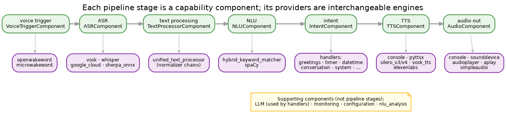

# Components and providers

Two words do a lot of work in Irene, so it's worth pinning them down:

- A **component** is a *capability* — "do ASR", "do TTS", "understand text". There is one per capability,
  it lives in the application layer, and the workflow talks to it through a port. Components are the
  pipeline stages.
- A **provider** is an *engine* — a concrete way to do that capability (Whisper or Vosk for ASR, Silero or
  ElevenLabs for TTS). A capability has a family of interchangeable providers; the component instantiates
  the one your config asks for, and can switch at runtime.

So the pipeline is a row of components, each backed by a menu of providers. Adding a new engine means
writing a provider and listing it as an entry-point — nothing in the pipeline changes (see
[adding a model](../guides/howto-new-model.md)).

## What a component does

A component coordinates: it reads its slice of config, instantiates the enabled providers, exposes the
capability through its port, and degrades gracefully when an engine or model is missing rather than taking
the system down. The TTS component, for instance, manages several TTS providers and routes each request to
the configured one.

## The odd ones out

- **Intent** is the exception. `IntentComponent` doesn't coordinate providers — it dispatches recognised
  intents to **handlers** (greetings, timer, datetime, conversation…). That world has its own shape; see
  [Intents](intents.md).
- **LLM** is a capability with providers (OpenAI, Anthropic, DeepSeek, a console echo) but not a pipeline
  stage — handlers call it when they need it (conversation, translation, text enhancement).
- **monitoring**, **configuration** and **nlu_analysis** are components too, but they support rather than
  process: metrics and notifications; the live config API the browser UI talks to; and the heavier spaCy
  analysis tooling.

## How it's assembled

Both components and providers are discovered through Python **entry-points** and instantiated only when the
config enables them. A deployment that doesn't use TTS never imports a TTS provider — which is what keeps a
build small and a startup fast (see the [build system](../guides/build-system.md)).
