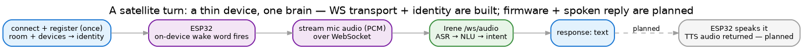
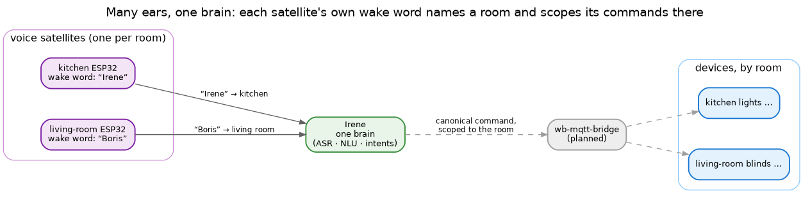

# ESP32 voice satellite

A voice satellite is a cheap microphone-and-speaker node in a room. It does the parts that have to be local
— capture audio, run a wake word, play a reply — and leaves the thinking to Irene over the network. One
Irene can serve a house full of them.

> **Status: partly built.** The WebSocket transport and the identity handshake exist today (Irene's
> `/ws/audio` endpoint). The ESP32 firmware itself — mic capture and the on-device wake word (a
> per-satellite model trained with the microWakeWord pipeline and flashed as tflite C headers) — and the
> spoken reply on the way back are designed but not yet built.

## A turn

When a satellite connects it **registers once**: it tells Irene its room and the devices in it, which Irene
records as the connection's identity. Then, per utterance:

- the **wake word fires on the device** — each satellite carries its own word as a small tflite model, so
  Irene isn't streaming or transcribing all day;
- the satellite **streams the audio** to Irene over the open socket;
- Irene runs the full pipeline — **ASR → NLU → intent** — exactly as for any audio input;
- the **response comes back** over the same socket: text today, and (planned) TTS audio the satellite plays.

To Irene this is simply an **input adapter** of format `audio` with the wake word already done — no special
case. The satellite is thin on purpose: no models, no intent logic, just ears and a mouth.

## How it fits

The wake word is also how you choose a room. Each satellite is trained for its **own** word — say "Irene"
in the kitchen, "Boris" in the living room — so the word you speak already selects the node, and the node
already knows its room (it said so at registration). The command is scoped before Irene has parsed a thing:
"включи свет" addressed to the kitchen node means the *kitchen's* lights. Any territorial division in the
house works this way, not only rooms — the wake word names the territory.

That same room/device identity is what the smart-home layer addresses ([MQTT](mqtt.md)), and what a
deferred result uses to find its way home: a timer set at the kitchen node speaks at the kitchen node.

Many ears, one brain — the heavy machinery lives in a single Irene; the rooms just need cheap nodes that
listen and speak.
