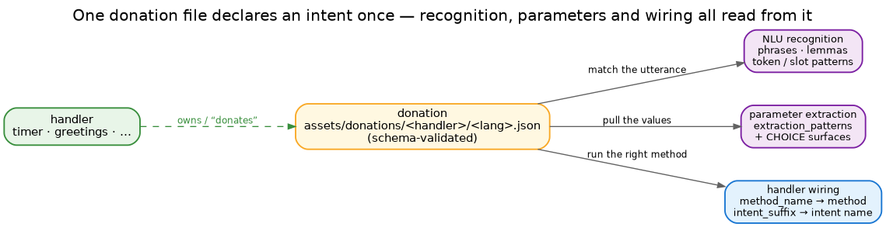
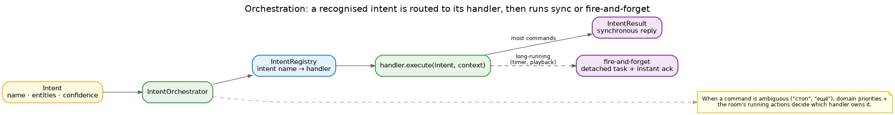

# Intents

NLU decides *what* the user meant; the intent system decides *what to do about it*. This is the domain —
the pure centre of the hexagon — and it is organised around one idea: every intent is declared once, in a
**donation**, and everything else reads from that declaration.

## Donations — declare it once

A handler "donates" the intents it can serve as a small JSON file per language
(`assets/donations/<handler>/<lang>.json`), validated against a schema. A donation isn't documentation —
it is wiring:

Each *method donation* (one per intent) carries:

- **Recognition** — `phrases`, `lemmas`, `token`/`slot` patterns: what the NLU matches the utterance against.
- **Parameters** — for each, an `extraction_patterns` list and any CHOICE surfaces (the spoken forms of a
  fixed set of options).
- **Wiring** — `method_name` (which handler method runs) and `intent_suffix` (e.g. `set` → the intent
  `timers.set`).
- **Examples** — utterances with their expected parameters, used to check the donation does what it claims.

Write the donation and the intent exists end to end: recognised, its parameters pulled, dispatched to the
right method — no logic in three places to keep in sync.

## Parameters

Parameters are extracted from the utterance using the donation's `extraction_patterns` — keyword and
regular-expression rules over the recognised text — and handed to the handler already typed and coerced
(`get_param("duration", int)`), with aliases and defaults applied. This lightweight path covers the common
commands; the harder cases — a device, a room and a value in one sentence — are where the heavier NLU tiers
come in (see [NLU](nlu.md)).

## Orchestration

Recognition produces an `Intent` — a name, entities and a confidence. The **orchestrator** looks the name
up in the **registry** to find the owning handler and runs it. When a command is ambiguous — a bare "стоп"
or "ещё" could belong to several handlers — **domain priorities** and the room's currently-running actions
decide who owns it, rather than guessing.

The handler then does one of two things:

- **Synchronous** — most commands: it computes a reply, returns an `IntentResult`, and the turn is done.
- **Fire-and-forget** — a timer, audio playback, anything that outlives the turn: it launches a detached
  task, registers it by the room/device identity, and returns an instant acknowledgement; the result is
  delivered later (see [data flow](dataflow.md)).

## Handlers

A handler is a small class of methods, each wired to an intent by its donation. It depends only on the
**domain ports** (`intents/ports.py`) — the capabilities it needs, injected by the application — so it
never reaches outward into components or delivery. Handlers are discovered through entry-points, so adding
one is additive.

A handler **is** a domain: `TimerIntentHandler` owns the `timer` domain and its seven intents
(`timer.set`, `timer.cancel`, `timer.stop`, …). So there are two ways to extend behaviour, and the
distinction is exactly handler-versus-intent:

- **A new intent on an existing handler** — another operation in a domain you already have (say
  `timer.repeat`): add a method to the handler plus its method donation. This is the common case.
- **A new handler** — a whole new area of behaviour (lights, media): a new handler class with its own
  domain, which brings its first intents along.

Both are walked through in [adding an intent](../guides/howto-new-intent.md).
