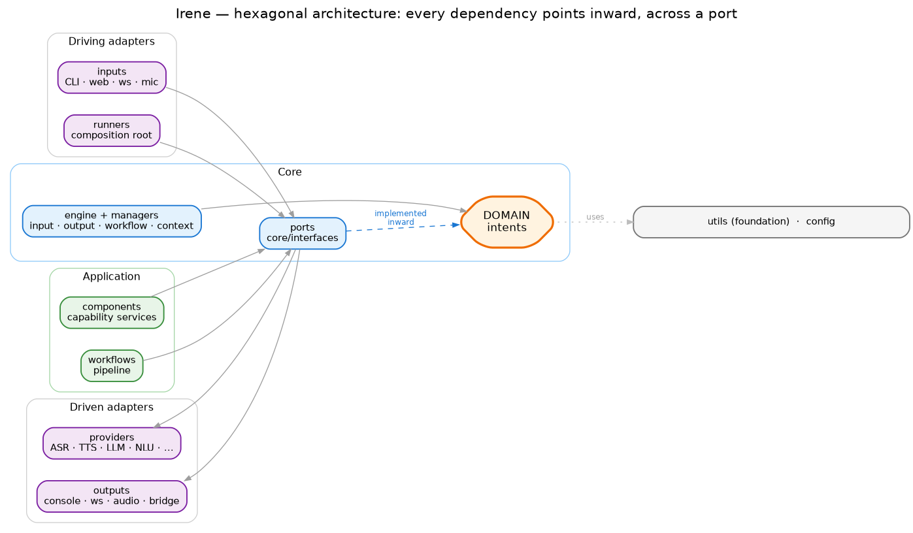
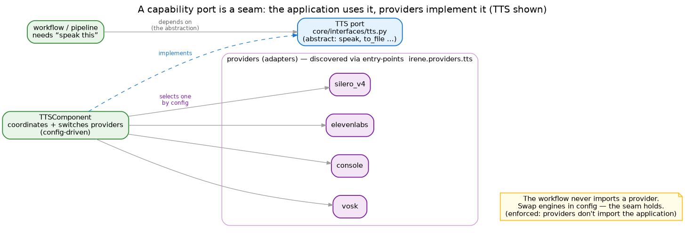

# Architecture overview

Irene is built as a **hexagon** — ports and adapters. The point isn't dogma; it's that the parts that
change often (speech engines, transports, smart-home back-ends) can be swapped without touching the parts
that shouldn't (intent logic, the pipeline). Everything is wired by configuration and discovered at
startup, so a deployment runs only what it is told to.

## The layers, and the one rule

Read it inside-out:

- **Domain — `intents`.** The pure centre: intent models, handlers, conversation context — where "what the
  user meant" lives. It reaches none of the outer layers.
- **Core — `core`.** The kernel: the engine, the managers (input, output, workflow, context, timers, event
  bus) and the **ports** in `core/interfaces`. Core never imports an outer layer.
- **Application — `components` and `workflows`.** The coordinators: capability components (TTS, ASR, NLU…)
  and the workflow that runs the pipeline. They depend inward on ports, never on delivery.
- **Adapters**, on two sides: **driving** (`inputs`, `runners`) push work *in*; **driven** (`providers`,
  `outputs`) are what the core drives *out*. Provider families are independent of one another.
- **Foundation — `utils`, `config`.** Used by everyone, depend on nothing upward.

The single rule the whole thing rests on: **every dependency points inward, across a port.** It isn't a
convention you have to remember — `import-linter` checks it on every commit (nine contracts), so a planted
backwards import fails the build.

## Ports — the seams

A **port** is a small abstract contract in `core/interfaces`. There are twelve, of two kinds:

- **Capability ports** — `asr`, `tts`, `llm`, `nlu`, `voice_trigger`, `text_processing`, `audio`: *the
  thing the pipeline needs*, independent of which engine provides it.
- **Structural ports** — `input`, `output`, `component`, `workflow`, `webapi`: the shape of a transport, a
  delivery channel, a component, a pipeline stage.

Each provider-backed capability is a **two-layer seam**: an application-side *component* coordinates a set
of interchangeable *providers* (adapters), selected by config and discovered through entry-points.

The payoff: the workflow asks to "speak this" and never learns whether Silero or ElevenLabs answered.
Change the provider in a TOML file and nothing in the pipeline moves.

## The seams, enforced

The nine `import-linter` contracts are the architecture made executable:

| Rule | In one line |
|---|---|
| Domain depends on nothing outward | `intents` can't reach components, workflows, providers or delivery |
| Config has no upward imports | configuration is a leaf |
| Components don't import delivery | the application stays unaware of CLI / web / runners |
| Adapters don't import application | providers can't reach into components or workflows |
| Provider families are independent | TTS knows nothing of ASR, and so on |
| Input port doesn't import its adapters | the port stays free of its concrete inputs |
| Core doesn't import the outer layers | the kernel faces only its ports and the domain |
| Utils depends on nothing upward | the foundation is pure |
| Analysis tooling is fenced | only `nlu_analysis` may use the heavy analysis package |

## Where to go next

- **[Workflow](workflow.md)** — how a request flows through the pipeline; the input/output model and the
  event bus.
- **[Data flow](dataflow.md)** — the concrete cases: text, voice, fire-and-forget, deferred results.
- **[Components & providers](components.md)** — what each capability does and how providers plug in.
- **[Intents](intents.md)** and **[NLU](nlu.md)** — the domain: recognition, donations, orchestration.
- **[MQTT integration](mqtt.md)** and **[ESP32 voice satellite](esp32.md)** — the smart-home and
  voice-node picture (planned).
