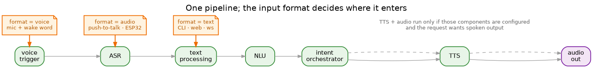
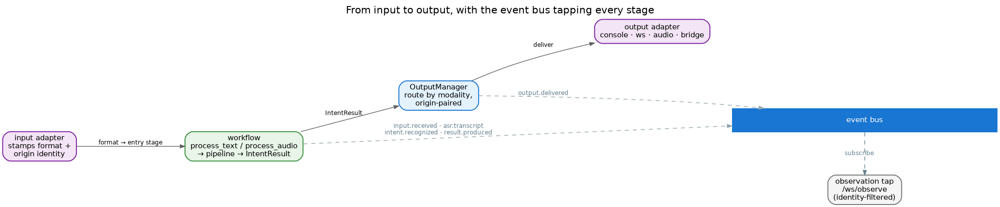

# Workflow

Every request — a typed line, a push-to-talk clip, a wake-word utterance — runs through **one** pipeline.
What differs is only where it enters and whether it ends in speech.

## The pipeline

The stages are fixed: voice trigger → ASR → text processing → NLU → intent orchestrator → TTS → audio out.
Which ones actually run is decided by the request's **format**, not by branching code:

- **`voice`** (mic + wake word) — the full pipeline, from the voice trigger.
- **`audio`** (push-to-talk, an ESP32 node) — skips the wake word, starts at ASR.
- **`text`** (CLI, web, a WebSocket frame) — skips audio entirely, starts at text processing.

Two things gate the stages. The **format** decides where a request *enters*; **configuration** decides which
stages *exist at all* — a stage runs only if its component is enabled. So TTS and audio playback happen only
when the TTS and Audio components are configured **and** the request asked for spoken output (likewise the
voice trigger needs both a `voice` request and a configured voice-trigger component). Format is a single
value the input adapter stamps, so there is no per-channel special-casing to drift out of sync.

The three entry points are the `WorkflowManager` methods `process_text_input`, `process_audio_input` and
`process_audio_stream` — the same workflow behind all of them.

## Input and output

Input and output are symmetric, and both are addressed by **identity** rather than guesswork:

- An **input adapter** captures a request and stamps two things: its **format** (which sets the entry
  stage above) and its **origin** — the channel, and where known the room, device or client.
- The workflow produces a format-neutral **`IntentResult`** — text, whether to speak it, any actions.
- The **OutputManager** decides where it goes by **modality**: a spoken or text reply returns to the
  channel that asked (origin-paired); a device command goes to the bridge; an announcement can be
  broadcast. When an output can't carry a modality it degrades (speech → text) or drops — it never
  mis-delivers.

Because origin travels with the request, a result always finds its way home — including a *deferred* one.
A timer that fires minutes later speaks in the room that set it, addressed by the persistent room/device
identity rather than by a conversation that may already have ended.

## The event bus

As it runs, the pipeline publishes a small, fixed vocabulary of events:

`input.received` · `asr.transcript` · `intent.recognized` · `result.produced` · `output.delivered` · `error`

Each carries the request's origin identity. The main consumer is the **observation tap** — a gated
`/ws/observe` WebSocket that streams the events, identity-filtered, so you can watch a live system (say,
one room's traffic) without perturbing it. Delivery itself is the OutputManager's job; it publishes
`output.delivered`, so what was sent is observable too.

A slow or stuck observer can't stall the pipeline: each subscriber is handed a bounded queue, and the bus
drops the oldest event rather than block.
