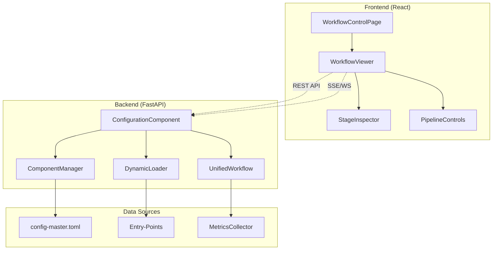

> **⚠️ ARCHIVED (2026-06-02) — deferred design, never built.** This is a Sep-2025 aspirational design for a
> config-ui "Workflow Control" pipeline-visualization page. It was reviewed during QUAL-25 and archived because
> (a) it is a *future UI feature*, not input to the current dataflow review/reconciliation, and (b) it assumes an
> idealized clean pipeline that QUAL-25 (`docs/review/dataflow_review.md`) proved is currently broken at many hops,
> and it specs `/workflow/*` endpoints that `architecture.md` §7 flags as **fictional**. The idea is preserved as a
> deferred backlog item — see **UI-4 [WORKFLOWVIZ]** in `docs/RELEASE_PLAN.md`. Not canonical; kept for rationale.

# Workflow Control & Data Flow Visualization

## Overview

This document outlines the design for a new **Workflow Control** page in the config-ui that provides real-time visualization and control of data flow through the Irene Voice Assistant system. This feature will integrate with the existing config-ui architecture to provide a comprehensive view of how data moves through the component and provider pipeline.

## 🎯 Purpose

The Workflow Control page will serve as a **live system dashboard** that allows administrators to:

1. **Visualize Data Flow**: See real-time data movement through the unified pipeline
2. **Monitor Component Health**: Track component and provider status and performance
3. **Control Pipeline Stages**: Enable/disable components and switch providers dynamically
4. **Debug Processing**: Inspect input/output at each pipeline stage
5. **Optimize Configuration**: Understand bottlenecks and provider performance

## 🏗️ Architecture Integration

### Frontend Integration with Existing Config-UI

The Workflow Control page will integrate seamlessly with the current config-ui architecture:

```typescript
// Addition to existing config-ui structure
src/
├── pages/
│   ├── OverviewPage.tsx           # ✅ Existing
│   ├── DonationsPage.tsx          # ✅ Existing  
│   ├── ConfigurationPage.tsx      # ✅ Existing
│   ├── MonitoringPage.tsx         # 🚧 Placeholder
│   └── WorkflowControlPage.tsx    # 🆕 NEW - This feature
├── components/
│   └── workflow/                  # 🆕 NEW - Workflow visualization
│       ├── WorkflowViewer.tsx     # React Flow based pipeline view
│       ├── ComponentNode.tsx      # Individual component visualization
│       ├── ProviderNode.tsx       # Provider visualization with status
│       ├── DataFlowEdge.tsx       # Data flow connections with metrics
│       ├── PipelineControls.tsx   # Start/stop/configure controls
│       ├── StageInspector.tsx     # Input/output inspection panel
│       ├── AudioPlayer.tsx        # Audio playback for input/output
│       ├── TextViewer.tsx         # Text content viewer with syntax highlighting
│       └── DataModal.tsx          # Click-to-view detailed data inspection
```

### Backend API Extensions

Leverage existing WebAPI infrastructure with new endpoints:

```python
# Extensions to existing irene/components/configuration_component.py
class ConfigurationComponent:
    # Existing methods...
    
    @webapi_endpoint("/workflow/graph")
    async def get_workflow_graph(self) -> Dict[str, Any]:
        """Get current workflow graph structure"""
        
    @webapi_endpoint("/workflow/status")  
    async def get_workflow_status(self) -> Dict[str, Any]:
        """Get real-time component and provider status"""
        
    @webapi_endpoint("/workflow/toggle-component")
    async def toggle_component(self, component: str, enabled: bool):
        """Enable/disable component dynamically"""
        
    @webapi_endpoint("/workflow/switch-provider")
    async def switch_provider(self, component: str, provider: str):
        """Switch active provider for component"""
        
    @webapi_endpoint("/workflow/stage-data/{component}")
    async def get_stage_data(self, component: str) -> Dict[str, Any]:
        """Get latest input/output data for specific component"""
        
    @webapi_endpoint("/workflow/audio-data/{component}")
    async def get_audio_data(self, component: str, data_type: str) -> StreamingResponse:
        """Stream audio data (input/output) for component as WAV/MP3"""
        
    @webapi_endpoint("/workflow/text-data/{component}")
    async def get_text_data(self, component: str, data_type: str) -> Dict[str, Any]:
        """Get formatted text data (input/output) for component"""
```

## 🔧 Technical Stack

### Recommended Technology Stack

Building on GPT-5's analysis and your existing architecture:

**Frontend (React Flow Integration with TypeScript)**:
- **React Flow** - For DAG visualization with custom nodes and edges
- **TypeScript** - Full type safety with existing config-ui patterns
- **TanStack Query** - For efficient data fetching and caching (already used)
- **Framer Motion** - For smooth animations during data flow
- **Tailwind + shadcn/ui** - Consistent with existing config-ui styling
- **Lucide React** - Icons for component status and controls
- **Web Audio API** - For audio playback of input/output samples
- **Monaco Editor** - For syntax-highlighted text viewing with JSON/YAML support

**Backend (FastAPI Extensions)**:
- **Server-Sent Events (SSE)** - For real-time data flow updates
- **Audio Streaming** - FastAPI StreamingResponse for audio data delivery
- **Base64 Encoding** - For embedding audio in JSON responses when needed
- **Existing ConfigManager** - Leverage TOML roundtrip capabilities
- **Entry-Points Discovery** - Use existing `dynamic_loader` for graph generation
- **Pydantic Models** - Extend existing config models for graph data

### TypeScript Integration Patterns

**Type-Safe API Client**:
```typescript
// Extend existing API client with workflow endpoints
interface WorkflowApiClient {
  getWorkflowGraph(): Promise<WorkflowGraph>;
  getStageData(component: string): Promise<StageData>;
  getAudioData(component: string, type: 'input' | 'output'): Promise<Blob>;
  getTextData(component: string, type: 'input' | 'output'): Promise<TextData>;
  toggleComponent(component: string, enabled: boolean): Promise<void>;
  switchProvider(component: string, provider: string): Promise<void>;
}

// Type definitions for workflow data
interface StageData {
  component: string;
  provider: string;
  input?: {
    type: 'text' | 'audio' | 'intent';
    content: string | ArrayBuffer;
    metadata: Record<string, any>;
  };
  output?: {
    type: 'text' | 'audio' | 'intent';
    content: string | ArrayBuffer;
    metadata: Record<string, any>;
  };
  timestamp: number;
  processing_time: number;
}

// Component interaction handlers
interface ComponentNodeProps {
  id: string;
  data: {
    component: string;
    provider: string;
    status: 'active' | 'idle' | 'error';
    hasAudio: boolean;
    hasText: boolean;
  };
  onClick: (component: string) => void;
}
```

### Data Flow Architecture



## 📊 Data Flow Visualization

### Pipeline Graph Structure

The visualization will represent your actual system architecture:

```
Entry Points → Core → Components → Providers → Output
     ↓           ↓         ↓          ↓         ↓
  [CLI/Web]  [AsyncCore] [ASR/TTS] [Whisper] [Audio]
            [Voice]                 [Vosk]   [Console]
            [Settings]              [Google]
```

### Component Hierarchy

**Level 1: Entry Points**
- CLI Runner
- WebAPI Runner  
- Vosk Runner
- Settings Runner

**Level 2: Core System**
- AsyncVACore
- ComponentManager
- UnifiedWorkflow

**Level 3: Components**
- ASR Component
- TTS Component
- Audio Component
- NLU Component
- Text Processor
- Intent System

**Level 4: Providers**
- Each component shows active provider
- Fallback providers as secondary connections
- Provider status (enabled/disabled/error)

### Real-time Data Flow

**Data Flow Indicators**:
- **Animated edges** showing data movement direction
- **Color coding** for data types (audio=blue, text=green, intents=purple)
- **Thickness** indicating data volume/frequency
- **Status indicators** for processing stages (pending/processing/complete/error)

**Performance Metrics**:
- Processing time per stage
- Throughput (requests/second)
- Error rates and failure points
- Component resource usage

## 🎮 Control Interface

### Pipeline Controls

**Component Management**:
- Toggle components on/off dynamically
- Switch active providers without restart
- View provider capabilities and status
- Configure provider-specific settings

**Workflow Controls**:
- Start/stop data processing
- Trigger test flows with sample data
- Clear pipeline buffers
- Reset component states

**Configuration Integration**:
- Live TOML config updates
- Provider discovery and availability
- Dependency validation before changes
- Backup/restore configurations

### Stage Inspector Panel

**Interactive Data Inspection**:
- **Click-to-View Text Data**: Click any component to view detailed text input/output
  - Syntax-highlighted JSON/YAML viewer using Monaco Editor
  - Side-by-side input/output comparison
  - Copy-to-clipboard functionality
  - Search and filter within text content
- **Click-to-Listen Audio Data**: Click audio components to hear actual audio
  - Web Audio API integration for playback controls
  - Waveform visualization for audio input/output
  - Volume controls and playback speed adjustment
  - Download audio samples for external analysis
- **Modal Data Viewer**: Expandable modal for detailed inspection
  - Full-screen text viewing with syntax highlighting
  - Audio player with advanced controls
  - Raw data export (JSON, audio files)
  - Historical data comparison

**Performance Debugging**:
- Processing time breakdown per stage
- Memory usage and resource consumption
- Queue depths and backlog monitoring
- Provider response times
- Audio quality metrics (sample rate, bit depth, duration)

## 🔄 Real-time Updates

### Server-Sent Events Implementation

```typescript
// Frontend SSE connection with TypeScript
interface WorkflowUpdate {
  type: 'component_status' | 'data_flow' | 'provider_switch' | 'stage_data';
  component?: string;
  provider?: string;
  status?: string;
  data?: {
    input?: {
      type: 'text' | 'audio' | 'intent';
      content: string | ArrayBuffer;
      metadata?: Record<string, any>;
    };
    output?: {
      type: 'text' | 'audio' | 'intent';
      content: string | ArrayBuffer;
      metadata?: Record<string, any>;
    };
  };
  timestamp: number;
}

const useWorkflowUpdates = () => {
  const [flowData, setFlowData] = useState<WorkflowUpdate[]>([]);
  const [stageData, setStageData] = useState<Record<string, WorkflowUpdate>>({});
  
  useEffect(() => {
    const eventSource = new EventSource('/api/workflow/events');
    
    eventSource.onmessage = (event) => {
      const update: WorkflowUpdate = JSON.parse(event.data);
      
      // Store stage data for click-to-view functionality
      if (update.type === 'stage_data' && update.component) {
        setStageData(prev => ({
          ...prev,
          [update.component!]: update
        }));
      }
      
      // Update component status, data flow, metrics
      updateFlowVisualization(update);
    };
    
    return () => eventSource.close();
  }, []);
  
  return { flowData, stageData };
};
```

### Event Types

**Component Events**:
```json
{
  "type": "component_status",
  "component": "asr",
  "status": "processing",
  "timestamp": 1703123456789
}
```

**Data Flow Events**:
```json
{
  "type": "data_flow",
  "from": "asr",
  "to": "text_processor", 
  "data_type": "text",
  "size": 1024,
  "processing_time": 0.15
}
```

**Provider Events**:
```json
{
  "type": "provider_switch",
  "component": "tts",
  "from_provider": "console",
  "to_provider": "elevenlabs",
  "status": "success"
}
```

**Stage Data Events** (for click-to-view/listen):
```json
{
  "type": "stage_data",
  "component": "asr",
  "provider": "whisper",
  "data": {
    "input": {
      "type": "audio",
      "content": "base64_encoded_audio_data",
      "metadata": {
        "sample_rate": 16000,
        "duration": 3.2,
        "format": "wav"
      }
    },
    "output": {
      "type": "text", 
      "content": "Hello, how can I help you today?",
      "metadata": {
        "confidence": 0.95,
        "processing_time": 0.15
      }
    }
  },
  "timestamp": 1703123456789
}
```

## 🎨 User Interface Design

### Layout Structure

```
┌─────────────────────────────────────────────────────────┐
│ Config-UI Header (existing)                            │
├─────────────────────────────────────────────────────────┤
│ Sidebar   │ Main Workflow View                         │
│           ├─────────────────────────────────────────────┤
│ • Overview│ ┌─── Pipeline Controls ───┐                │
│ • Donations │ │ ▶️ Start │ ⏸️ Pause │ 🔄 Reset │        │
│ • Config  │ └─────────────────────────┘                │
│ • Monitor │                                            │
│ ► Workflow│ ┌──── Component Graph ────────────────────┐ │
│           │ │                                        │ │
│           │ │  [Entry] → [Core] → [Components]       │ │
│           │ │     ↓        ↓         ↓              │ │
│           │ │  [CLI]   [Manager]  [ASR] → [Whisper] │ │
│           │ │  [Web]   [Workflow] [TTS] → [Console] │ │
│           │ │                                        │ │
│           │ └────────────────────────────────────────┘ │
│           │                                            │
│           │ ┌──── Stage Inspector ────────────────────┐ │
│           │ │ Component: ASR                         │ │
│           │ │ Provider: Whisper                      │ │
│           │ │ Input: [🎵 audio waveform] 🔊 Click    │ │
│           │ │ Output: "Hello world" 📝 Click         │ │
│           │ │ Time: 0.25s | Status: ✅ Success       │ │
│           │ │ [📤 Export Data] [🔍 View Details]     │ │
│           │ └────────────────────────────────────────┘ │
└─────────────────────────────────────────────────────────┘
```

### Visual Design Elements

**Component Nodes** (Interactive):
- Rounded rectangles with component icons
- Status indicator LEDs (green/yellow/red)
- Provider name below component name
- Processing activity animations
- **Click interaction**: Hover effect with "Click to inspect" tooltip
- **Audio indicators**: 🎵 icon for components with audio data
- **Text indicators**: 📝 icon for components with text data

**Data Flow Edges**:
- Animated directional arrows
- Color-coded by data type (audio=blue, text=green, intents=purple)
- Thickness represents data volume
- Dash patterns for different flow types
- **Click interaction**: Show data transfer details

**Interactive Controls**:
- **Audio Player Component**: Embedded audio controls with waveform
- **Text Viewer Component**: Monaco Editor with syntax highlighting
- **Data Modal**: Full-screen overlay for detailed inspection
- **Export Buttons**: Download audio/text samples
- **Copy Buttons**: Copy text data to clipboard

**Control Panels**:
- Consistent with existing config-ui design
- shadcn/ui components for controls
- Real-time status indicators
- Error highlighting and notifications
- **New UI Elements**: Audio player controls, text viewer buttons

## 🚀 Implementation Phases

### Phase 1: Foundation (Week 1-2)
- **Basic React Flow Integration**: Static graph generation from config
- **Component Node Rendering**: Display components and providers
- **API Endpoints**: Basic graph structure and status endpoints
- **Navigation Integration**: Add to existing config-ui sidebar

### Phase 2: Real-time Updates & Basic Interaction (Week 3-4)
- **SSE Implementation**: Real-time data flow events with TypeScript interfaces
- **Dynamic Graph Updates**: Live component status updates
- **Basic Click Interaction**: Component click to show summary data
- **Performance Metrics**: Processing time display

### Phase 3: Interactive Data Inspection (Week 5-6)
- **Audio Player Integration**: Web Audio API implementation for click-to-listen
- **Text Viewer Integration**: Monaco Editor for click-to-view text data
- **Data Modal System**: Full-screen inspection with export capabilities
- **Component Controls**: Enable/disable components and provider switching

### Phase 4: Advanced Features & Polish (Week 7-8)
- **Advanced Audio Features**: Waveform visualization, playback controls
- **Text Analysis Tools**: Search, filter, syntax highlighting for JSON/YAML
- **Data Export System**: Download audio samples and text data
- **Historical Data**: View previous inputs/outputs with timeline
- **Mobile Responsiveness**: Tablet/mobile optimization for touch interactions

## 📈 Success Metrics

### Technical Metrics
- **Real-time Performance**: < 100ms update latency
- **System Impact**: < 5% overhead on pipeline performance
- **Reliability**: 99.9% uptime for monitoring features
- **Responsiveness**: 60fps animations and interactions

### User Experience Metrics
- **Discoverability**: Users can identify bottlenecks within 30 seconds
- **Control Efficiency**: Component changes applied within 2 seconds
- **Debugging Speed**: 50% reduction in time to identify issues
- **Learning Curve**: New users productive within 10 minutes

## 🔗 Integration Points

### Existing Config-UI Features
- **Shared Authentication**: Use existing session management
- **Consistent Styling**: Leverage existing Tailwind/shadcn setup
- **API Infrastructure**: Extend existing API client patterns
- **Error Handling**: Consistent error display and recovery

### Backend System Integration
- **Entry-Points Discovery**: Use existing `dynamic_loader`
- **Configuration Management**: Leverage existing TOML roundtrip
- **Component Manager**: Integrate with existing component lifecycle
- **Metrics Collection**: Extend existing metrics infrastructure

## 🔮 Future Enhancements

### Advanced Visualization
- **3D Pipeline View**: Immersive workflow visualization
- **Timeline Playback**: Replay data flow history
- **Custom Layouts**: User-configurable graph arrangements
- **Multi-Workflow Support**: Handle multiple concurrent workflows

### AI-Powered Features
- **Anomaly Detection**: Automatic identification of performance issues
- **Optimization Suggestions**: AI-recommended configuration improvements
- **Predictive Scaling**: Anticipate resource needs based on patterns
- **Smart Debugging**: AI-assisted root cause analysis

### Enterprise Features
- **Multi-Instance Management**: Control multiple Irene deployments
- **Role-Based Access**: Fine-grained permission controls
- **Audit Logging**: Complete activity tracking and compliance
- **Integration APIs**: External monitoring system integration

---

**This workflow control feature will transform the config-ui from a configuration interface into a comprehensive system administration and monitoring platform, providing unprecedented visibility and control over the Irene Voice Assistant's sophisticated pipeline architecture.**
