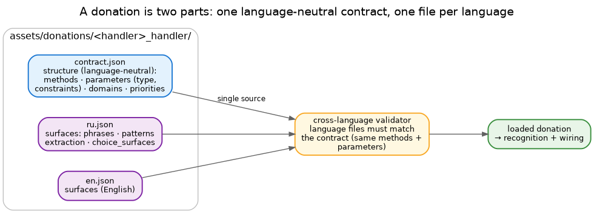

# Donation file specification (v1.1)

A **donation** is how a handler declares the intents it serves — the recognition phrases, the parameters,
and the wiring to its methods. As of v1.1 a donation is split in two:

- **`contract.json`** — the language-neutral **structure**: which methods exist, which parameters they take
  (with types and constraints), the handler's domains and priorities. One per handler.
- **`<lang>.json`** (`ru.json`, `en.json`, …) — the language **surfaces**: how each intent is actually said
  in that language (phrases, patterns) and how its parameters are pulled from those words.



The contract is the single source of truth for *structure*; the language files supply *words*. A
cross-language validator checks that every language file matches the contract — same methods, same
parameters — so the two cannot drift apart.

## Layout

```
assets/donations/<handler>_handler/
  contract.json      # structure (language-neutral)
  ru.json            # Russian surfaces
  en.json            # English surfaces
```

The directory is named after the handler; `handler_domain` inside names the domain it owns (often the same
word).

## contract.json

Validated against `assets/donation_contract_v1.1.json`.

| Field | Meaning |
|---|---|
| `schema_version` | `"1.1"` |
| `handler_domain` | the domain this handler owns (e.g. `timer`) |
| `description` | one line |
| `domain_patterns` | domains this handler answers to |
| `intent_name_patterns` | intent names it answers to |
| `action_domain_priority` | priority for contextual disambiguation (see below) |
| `method_donations` | the intents — one entry per method |
| `global_parameters` | parameters shared by all methods |

Each **method donation**:

| Field | Required | Meaning |
|---|---|---|
| `method_name` | yes | the handler method to call (`_handle_set_timer`) |
| `intent_suffix` | yes | combined with the domain → the intent name (`set` → `timer.set`) |
| `boost` | no | recognition-confidence nudge |
| `room_context` | no | whether the intent is room-scoped |
| `parameters` | no | the structural parameter list |

Each **parameter** (structure):

| Field | Required | Meaning |
|---|---|---|
| `name` | yes | the name handlers read with `get_param` |
| `type` | yes | `string` · `integer` · `float` · `duration` · `datetime` · `boolean` · `choice` · `entity` |
| `required` | no | whether the intent needs it |
| `choices` | no | allowed values (for `choice`) |
| `min_value` / `max_value` | no | numeric bounds |
| `pattern` | no | a validation regex |
| `entity_type` | no | `device` · `location` · `room` · `person` · `generic` |

## Language files (`<lang>.json`)

The same `method_donations`, keyed by `method_name`, but carrying the **words**:

| Field | Meaning |
|---|---|
| `phrases` | trigger phrases the keyword matcher compares against |
| `lemmas` | base-form tokens for the spaCy tier |
| `token_patterns` / `slot_patterns` | spaCy matcher patterns |
| `examples` | sample utterances with expected parameters (used to check the donation) |
| `parameters[].extraction_patterns` | regexes that pull this parameter's value from the text |
| `parameters[].aliases` | alternative spoken forms |
| `parameters[].default_value` | value used when the parameter is absent |
| `parameters[].choice_surfaces` | the spoken forms of each `choice` value, localised |

Plus top-level arrays for whole-handler matching: `action_patterns` (verbs/phrases that mark this handler's
commands), `stop_command_patterns` (phrases that stop a running action), `negative_patterns` (phrases that
should *not* match).

## Domain priority

When a bare command ("стоп", "ещё") could belong to several handlers, `action_domain_priority` decides who
wins, together with the room's running actions. Higher wins. Keep priorities sparse and intentional — they
are a tie-breaker, not a routing table.

## Localisation

Every intent in `contract.json` must appear in every language file, with the same parameters. Adding a
language means adding a `<lang>.json` with that language's phrases and extraction patterns — the contract
doesn't change (see [adding a language](howto-new-language.md)).

## Validation

`contract.json` validates against the JSON schema (`assets/donation_contract_v1.1.json`); the cross-language
validator checks each language file against the contract. Both run at startup — a handler with a missing or
mismatched donation fails loudly rather than misbehaving quietly.
