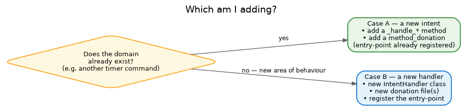

# Adding an intent

In Irene a **handler is a domain** — one class that owns a family of related intents (the `timer` handler
owns `timer.set`, `timer.cancel`, `timer.stop`, …). So "adding a command" is one of two things:



- **Case A — a new intent on an existing handler.** The domain already exists; you're adding an operation.
- **Case B — a new handler.** A whole new area of behaviour.

Either way the rule is the same: an intent is **declared in a donation**, and the code just implements the
method. A donation comes in two parts — `contract.json` (the language-neutral structure: methods and
parameter types) and one `<lang>.json` per language (the phrases and extraction patterns) — so you touch
both. (For the full schema, see the [donation file specification](DONATION_FILE_SPECIFICATION.md).)

## Case A — a new intent on an existing handler

Say the `timer` handler should learn `timer.repeat`. No wiring — just the method and its donation.

**1. Add the method** to `irene/intents/handlers/timer.py`:

```python
async def _handle_repeat_timer(self, intent: Intent, context: UnifiedConversationContext) -> IntentResult:
    minutes = self.get_param(intent, "duration", 5)        # typed via the default (int)
    # ... start the repeating timer ...
    return IntentResult(text=f"Повторяю каждые {minutes} минут.", should_speak=True)
```

**2. Declare its structure** in `assets/donations/timer_handler/contract.json` — a `method_donation` with
the parameter types:

```json
{
  "method_name": "_handle_repeat_timer",
  "intent_suffix": "repeat",
  "parameters": [
    { "name": "duration", "type": "integer", "required": false }
  ]
}
```

**3. Add the words** to each language file (`ru.json`, `en.json`) — same `method_name`, now with phrases and
extraction patterns:

```json
{
  "method_name": "_handle_repeat_timer",
  "intent_suffix": "repeat",
  "phrases": ["повторяй таймер каждые", "repeat timer every"],
  "parameters": [
    { "name": "duration", "extraction_patterns": ["(\\d+)"] }
  ]
}
```

The entry-point is already registered and donation routing dispatches `timer.repeat` to your method. The
parameter set must agree between the contract and every language file — the cross-language validator
checks it.

## Case B — a new handler

A new domain — say weather. A class, a contract, language files, and one line of registration.

**1. The handler** — `irene/intents/handlers/weather.py`:

```python
from ..models import Intent, IntentResult
from ..context_models import UnifiedConversationContext
from .base import IntentHandler

class WeatherIntentHandler(IntentHandler):
    @classmethod
    def get_python_dependencies(cls) -> list[str]:
        return []                                          # pyproject EXTRA name(s) if the handler needs any,
                                                           # e.g. ["nlu-spacy"] — not a raw package spec

    async def can_handle(self, intent: Intent) -> bool:
        return self.has_donation() and intent.domain == "weather"

    async def execute(self, intent: Intent, context: UnifiedConversationContext) -> IntentResult:
        return await self.execute_with_donation_routing(intent, context)   # method_name → _handle_*

    async def _handle_current(self, intent: Intent, context: UnifiedConversationContext) -> IntentResult:
        city = self.get_param(intent, "city", "вашем городе")
        return IntentResult(text=f"Сейчас в {city} ясно.", should_speak=True)
```

**2. The contract** — `assets/donations/weather_handler/contract.json` (structure):

```json
{
  "schema_version": "1.1",
  "handler_domain": "weather",
  "description": "Weather queries",
  "method_donations": [
    {
      "method_name": "_handle_current",
      "intent_suffix": "current",
      "parameters": [
        { "name": "city", "type": "string", "entity_type": "location" }
      ]
    }
  ]
}
```

**3. The language files** — `assets/donations/weather_handler/{ru,en}.json` (surfaces). Copy an existing
handler's file for the header and adapt:

```json
{
  "schema_version": "1.1",
  "handler_domain": "weather",
  "language": "ru",
  "method_donations": [
    {
      "method_name": "_handle_current",
      "intent_suffix": "current",
      "phrases": ["какая погода", "погода в"],
      "parameters": [
        { "name": "city", "extraction_patterns": ["в ([А-Яа-я]+)"], "default_value": "вашем городе" }
      ]
    }
  ]
}
```

**4. Register it** in `pyproject.toml` so it is discovered:

```toml
[project.entry-points."irene.intents.handlers"]
weather = "irene.intents.handlers.weather:WeatherIntentHandler"
```

After editing entry-points, reinstall (`uv sync`) so the new handler is picked up.

## Long-running actions — fire-and-forget and durability

If a handler needs to do something *after* replying — ring in ten minutes, finish a long playback — it
launches a **fire-and-forget action** instead of blocking:

```python
await self.execute_fire_and_forget_with_context(
    self._do_it_later,                     # your coroutine
    action_name=my_id, domain="weather", context=context,
    timeout=duration + 5.0,
    completion_message="Готово: ...",      # announced when it finishes, in the user's language
    city=city,                             # your coroutine's own kwargs
)
```

The machinery tracks the action, announces its completion — and, by default, its failure — back to the room
that asked, and lets a later «стоп» find it.

**If the action is a promise** — it changes or reports something *beyond the current exchange* — declare it
durable:

```python
    durable=True,                  # the promise survives a restart
    redeliver_on_reconnect=True,   # ...and a briefly-offline speaker
```

A durable action's record is persisted (under the assets tree, outside any container), and at startup Irene
re-arms it with the remaining time — or, if the moment passed while she was down, announces it late with an
apology (up to an hour) or as expired after that. Two obligations come with the flag:

- **your launch kwargs must be JSON-serializable** — they are exactly what re-arms the action (a
  non-serializable launch fails immediately, on purpose);
- **override `rearm_durable_action(record)`**: recompute what remains and relaunch through the same launch
  call, reusing `record.action_name`. `TimerIntentHandler.rearm_durable_action` is the reference
  implementation.

Set `redeliver_on_reconnect=True` when a missed announcement loses real value (a timer's ring: yes; "playback
started": no) — the completion is then kept for up to an hour and spoken when the room's device reconnects.

Three rules, whatever you launch:

- **don't schedule future work outside this launch** (no bare `asyncio.sleep` promises, no ad-hoc
  `create_task` timers) — it would be invisible to «стоп» and listing, and would die silently in a restart;
- **fail loudly** — raise on failure (or return `False`; it's converted). Failures are announced to the user
  by default: don't route around that;
- **action names are minted per launch** — never reuse one (restart re-arm is the only legitimate reuse, and
  the machinery does that for you).

## Try it

```
uv run python -m irene.runners.cli -c configs/config-master.toml --command "погода в Москве"
```

If recognition misses, check the donation `phrases`/patterns first — recognition lives there, not in the
handler. For how the pieces connect, see [Intents](../architecture/intents.md) and [NLU](../architecture/nlu.md).
