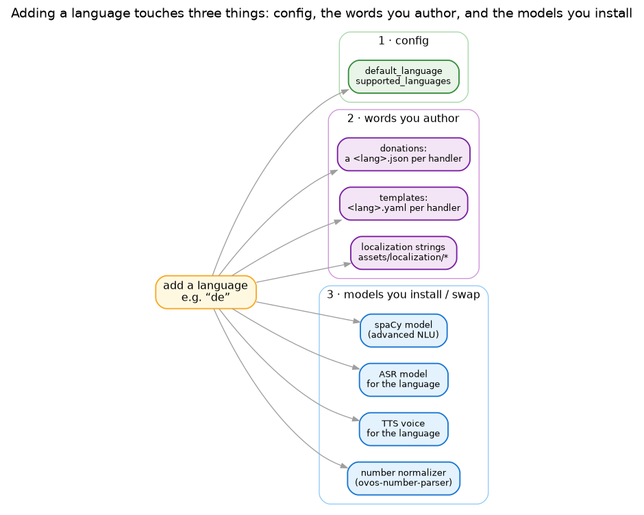

# Adding a language

A language is more than a translation file. To make Irene understand and answer in a new one you touch three
kinds of thing: the **config** that admits it, the **words** you author, and the **models** you install.



This guide uses German (`de`) as the example; substitute your code throughout. For a complete worked
example, the shipped **English** deployment configs (`configs/*-en.toml`) are full copies of their Russian
counterparts with only the language-bearing fields swapped — a good template for a new single-language build.

## 1. Config

Declare the language in `CoreConfig` (your config file):

```toml
default_language = "ru"                  # the canonical default; detection falls back to it
supported_languages = ["ru", "en", "de"]
```

`supported_languages` is the gate — language detection clamps to this list, and anything outside it falls
back to `default_language`. (`language` is a deprecated legacy field; ignore it.)

## 2. The words you author

Language-specific text you write by hand:

- **Donations** — for every handler, add a `<lang>.json` (here `de.json`) beside its `contract.json`, with
  the German phrases and extraction patterns. The contract doesn't change; only the surfaces do (see the
  [donation spec](DONATION_FILE_SPECIFICATION.md)). Skip a handler and that command simply won't be
  understood in German.
- **Templates** — reply text lives in `assets/templates/<handler>_handler/<lang>.yaml`. Add a `de.yaml` per
  handler with the German responses.
- **Localization** — shared strings under `assets/localization/*` (domains, rooms, datetime, …) need their
  German entries.

## 3. The models you install or swap

Recognition and speech are language-specific, so the heavy assets change too:

- **spaCy** (the advanced NLU tier) — add the language to `language_preferences` in
  `irene/providers/nlu/spacy_provider.py` and install its model:
  ```python
  language_preferences = { "ru": [...], "en": [...], "de": ["de_core_news_md", "de_core_news_sm"] }
  ```
  Without a spaCy model for the language, only the keyword tier works for it.
- **ASR** — a model that covers the language: a per-language Vosk model, or a multilingual engine like
  Whisper. Configure it in `[asr]`.
- **TTS** — a voice for the language: a per-language Silero model, or a cloud/multilingual TTS. Configure it
  in `[tts]`.
- **Number normalization** — spoken numbers are language-specific. Irene routes Russian through a
  dependency-free path and other languages through **ovos-number-parser** (which covers many languages);
  enable the matching normalizer for the new language in `[text_processor]`.

The **wake word** is word-, not language-specific — it keeps working — though you may want one that suits the
new language's speakers (see [adding a model](howto-new-model.md); on-device wake words are the
[locveil-satellite](https://github.com/locveil/locveil-satellite) product's side).

## Checklist

- [ ] `supported_languages` includes the language
- [ ] a `<lang>.json` donation for every handler
- [ ] a `<lang>.yaml` template for every handler
- [ ] localization strings filled in
- [ ] a spaCy model installed and added to `language_preferences`
- [ ] ASR and TTS models that cover the language, configured
- [ ] number normalization enabled for the language
