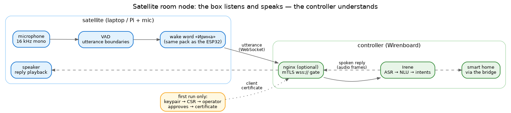

# Satellite room nodes

A satellite is a small box with a microphone and a speaker — a laptop for trying things out, a
Raspberry Pi in the kitchen for real — that listens for the wake word locally and sends what
you said to the controller. The controller does the understanding and sends the spoken reply
back to the same room. No models, no heavy lifting on the satellite: it needs Python, a mic,
and a network.



## Running one

```bash
uv run irene-satellite -c configs/satellite.toml
```

The shipped `configs/satellite.toml` is the curated profile: microphone, voice detection, the
wake word «Ирина» and audio playback on — everything else off, because the controller owns it.
Point it at your controller and name the room:

```toml
[satellite]
enabled = true
server_url = "ws://wb7:8080"
client_id = "kitchen_satellite"   # a stable, per-room identity
room_name = "Кухня"
```

The room name matters: say «включи свет» to the kitchen satellite and the kitchen lights go
on — commands resolve to the room they were spoken in, and timers set by voice ring back on
the same box, even if it rebooted in between.

For quick experiments the flags override the config per run:

```bash
uv run irene-satellite -c configs/satellite.toml --server ws://wb7:8080 --room "Кухня"
uv run irene-satellite -c configs/satellite.toml --no-wake     # skip the wake word
```

## Talking to it

Say **«Ирина»**, pause briefly, then the command. The satellite prints «Слушаю…» when it hears
its name; the next thing you say goes to the controller as the command. If nothing follows
within a few seconds, it goes back to sleep.

With `--no-wake` every detected utterance is sent — handy while testing, chatty in a real room.

Two modes exist:

- **`single`** (the default): the satellite decides where your utterance ends and sends it as
  one piece — the same behavior a firmware voice node has.
- **`streaming`**: the satellite streams audio continuously and the *controller* decides where
  utterances end, showing partial transcriptions as you speak. Wake word and local voice
  detection are bypassed — this is the always-on mode, mainly for testing the controller's
  streaming recognition.

## Securing the connection

On a home LAN, plain `ws://` is fine. For anything more exposed, the satellite speaks mutual
TLS through the controller's nginx gate — the same certificate plane the ESP32 fleet uses. The
satellite enrolls itself on first run:

```toml
[satellite]
server_url = "wss://wb7"

[satellite.tls]
enabled = true
bootstrap_url = "http://wb7"    # only used until the certificate is issued
```

First start walks the enrollment: the satellite generates a private key (it never leaves the
box), submits a signing request to the controller, and waits, printing the exact command the
operator must run on the controller to approve it:

```
  Approve on the controller (as root):
    esp32-provision approve kitchen_satellite
```

Once approved, the certificate lands in the satellite's credentials folder and every later
start connects straight over `wss://`. The certificate *is* the identity: the controller
refuses a connection whose certificate doesn't match the claimed `client_id`, so a
certificate issued to the kitchen can never register as the bedroom.

Certificates and keys live under the assets folder (`credentials/satellite/`) — they are never
part of the configuration file and never belong in version control.

## What it doesn't do

The satellite doesn't recognize speech, match intents, or talk to the smart home — that is all
the controller's job, which is exactly what makes a satellite cheap to run. If the controller
is unreachable, the satellite keeps trying in the background (backing off up to 30 seconds
between attempts) and picks up where it left off; an utterance spoken while disconnected is
lost, not queued.
